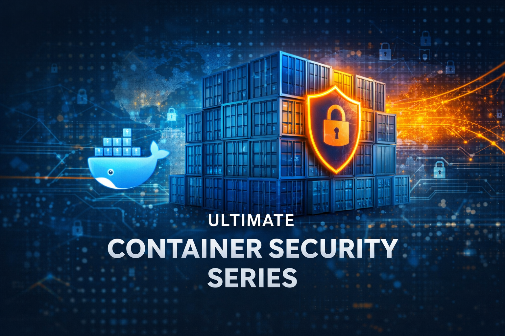

# Ultimate Container Security Series

Welcome to the **Ultimate Container Security Series**.

This series is an attempt to bring together the **key concepts, real-world scenarios, and practical recipes** needed to understand and apply container security effectively. The goal is to help readers **learn the topics faster**, with examples that can be easily applied in real production environments. Whenever possible, **working examples** will be included to make the concepts easier to understand.

# Series Structure

The series will be divided into five main parts, and each part will consist of multiple chapters.

You can use this page as the main reference to see:
- what has already been written,
- when a chapter was last updated,
- and which topics are coming next.

This page will also be used for future announcements and updates related to the series.

# Main Outline

### PART 1: Foundations
- [Chapter 1: Container Security Threat Model](./part_01_Foundations/00_chapter_Container_Basics/README.md) (updated: 4.1.2026)
- Chapter 2: How Container Isolation Works (writing in progress)

### PART 2: Secure Container Image Building

### PART 3: Registries & Supply Chain Security

### PART 4: Host & Container Platform Security

### PART 5: Container Runtime Security

# Goals of the Series

The goal of this series is to provide an up-to-date overview of the most important container security topics, supported by real examples and best-practice solutions.

Container technologies evolve very quickly, so this series is not static. Chapters may be:
- updated,
- expanded,
- reorganized,
- or extended with new topics over time.

The dates listed next to each topic in this post will serve as a reference point to indicate when a resource was last updated.

If there is a **specific container security topic you are interested in, feel free to open an issue**.
