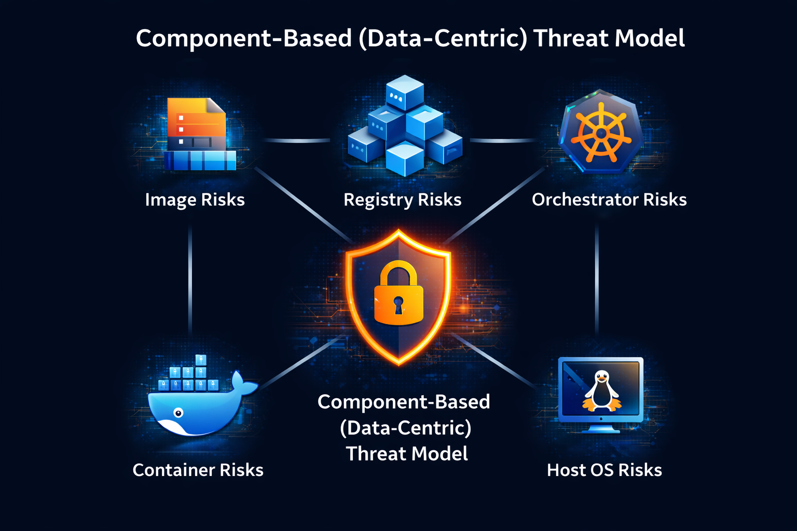
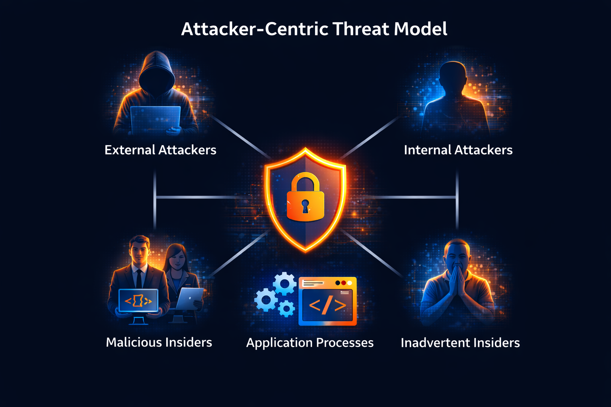
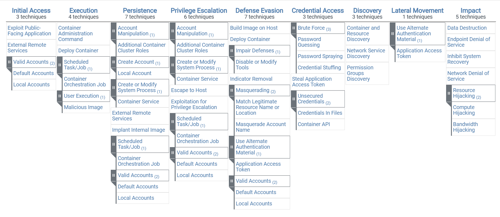

# Chapter 1: Container Security Threat Model

Before talking about tools, configurations, or best practices, it is important to understand what we are actually trying to protect and from whom. This is where a threat model comes in. A threat model provides a structured way to reason about security risks.

## What Is a Threat Model?

To understand threat modeling, it helps to clearly distinguish a few related concepts.
- A **risk** is a potential problem and the impact it would have if it occurred.
- A **threat** is a possible path that could lead to that risk becoming real.
- A **mitigation** is a countermeasure that reduces the likelihood of a threat succeeding or limits its impact.

> *A simple example can help illustrate this:* Imagine you work from home and rely on a laptop that contains sensitive work data. The risk is that this data could be stolen. The threats are the different ways this might happen: someone breaking into your house, stealing the laptop from your car, or tricking you into installing malware. Mitigations could include locking your doors, encrypting the disk, or using strong authentication.

The key point is that a single risk can have many different threats, and each threat may require different mitigations.

## Why Threat Models Differ

Risks vary significantly depending on the context.

A bank holding customer funds will focus heavily on preventing financial theft. An e-commerce platform may prioritize fraud and availability. A personal blog might be most concerned with account takeover or defacement.

Regulatory environments also affect risk. For example, leaking personal data may be primarily a reputational issue in some regions, while in others, such as the European Union, regulations like GDPR can result in substantial financial penalties.

Because risks differ, the importance of specific threats and the appropriate mitigations will also differ. This is why threat modeling is not about finding a single “correct” list of threats, but about systematically identifying and prioritizing the threats that matter in a given environment.

Threat modeling is the process of identifying and enumerating potential threats to a system by examining its components, interfaces, and modes of operation. Done well, it highlights where a system is most exposed and where security efforts will have the greatest effect.

The goal of this chapter is to establish a shared mental model that will be used throughout the rest of the series. We will look at different ways container threats are commonly structured and explain which approach this series will follow.

## Common Ways to Structure a Container Threat Model

There is no single comprehensive threat model that fits all environments. However, several well-established approaches are commonly used in container security. Each emphasizes a different perspective.

### Component-Based (Data-Centric) Threat Model

One common approach is to **model threats around the core components of a containerized environment**. This is the approach taken by [NIST Special Publication 800-190: Application Container Security Guide](https://nvlpubs.nist.gov/nistpubs/SpecialPublications/NIST.SP.800-190.pdf), which identifies major risks associated with the following components:
- Image risks
- Registry risks
- Orchestrator risks
- Container risks 
- Host OS risks

> The NIST Special Publication 800-190 was written in 2017 and, unfortunately, has not been updated. Due to this, it does not touch on some of the newer threats and technologies that have emerged since then.

This type of threat model is often called component-based, because each component represents a distinct surface an attacker might target.

By examining each component independently, this model helps architects and operators understand where controls must exist and how failures in one area can affect the rest of the system.

NIST SP 800-190 uses this component-based structure to remain vendor-neutral and applicable across different container platforms.

In this series, we use the same underlying risks identified by NIST, but reorganize them along the container lifecycle to make them easier to learn and apply in practice.

### Attacker-Centric Threat Model

Another way to structure a threat model is to focus on who the attacker is, rather than where they attack.

In the [book Container Security, Liz Rice](https://www.oreilly.com/library/view/container-security/9781492056690/) describes a threat model based on the different actors that may interact with or compromise a containerized system, including:
- **External attackers** attempting to access a deployment from outside.
- **Internal attackers** who have gained some level of access.
- **Malicious insiders**, such as developers or administrators with legitimate privileges.
- **Inadvertent insiders** who accidentally introduce security issues.
- **Application processes** that may misuse their programmatic access.

This attacker-centric approach is particularly useful for understanding intent, privilege levels, and realistic attack paths. It is often used in incident response, threat hunting, and security reviews.

### MITRE ATT&CK for Containers

A more technique-driven approach is provided by [MITRE ATT&CK for Containers](https://attack.mitre.org/matrices/enterprise/containers/).

This framework categorizes adversary behavior into tactics and techniques across the stages of an attack lifecycle, such as:
- initial access,
- execution,
- persistence,
- privilege escalation,
- defense evasion,
- credential access,
- discovery,
- lateral movement,
- and impact.

Image source: [MITRE ATT&CK for Containers](https://attack.mitre.org/matrices/enterprise/containers/)

MITRE ATT&CK is especially useful for detection and response, as it helps security teams understand how attacks progress over time and which behaviors to monitor at runtime. While powerful, it is often too detailed to serve as an introductory threat model on its own.

### Lifecycle-Based Threat Model

The final approach is to **structure threats along the container lifecycle**. This model focuses on when threats occur rather than where or who is involved. It aligns closely with how containerized systems are built and operated in practice.

In this series, we use the following lifecycle stages:
- **Build** - PART 2: Secure Container Image Building
- **Distribution** - PART 3: Registries & Supply Chain Security
- **Deployment** - PART 4: Host & Container Platform Security
- **Runtime** - PART 5: Container Runtime Security

This approach allows us to reason about threats in the same order containers move through the system, while still incorporating insights from component-based and attacker-centric models.

There is no single threat model that fits every environment, but many of the threats discussed in this series are common to most container deployments, regardless of scale or platform.

## Identifying Attack Vectors

Once a threat model is defined, the next step is to identify **attack vectors**, the concrete entry points an attacker may use to exploit the system.

In containerized environments, attack vectors can appear at **every stage of the container lifecycle** and across **multiple components**. Common examples include:

- Vulnerable application code running inside containers
- Insecure container image build configurations
- Compromised or untrusted container image supply chains
- Insecure image storage and retrieval mechanisms
- Weak host machine and kernel security
- Exposed or over-privileged credentials and tokens
- Flat or poorly segmented container networking
- Container escape vulnerabilities

## General Security Principles

Regardless of the specific threat model or deployment architecture, certain **security principles consistently reduce risk** in containerized environments.

These principles do not replace a threat model. Instead, they **guide how mitigations are selected and applied**, and they will be revisited throughout the rest of this series:

- Regular audits and timely updates
- Applying the principle of least privilege
- Network segmentation and isolation
- Runtime visibility and enforcement
- Continuous image scanning
- Defense in depth rather than single controls
- Reducing the exposed attack surface
- Limiting the blast radius of a compromise
- Clear segregation of duties between roles and systems
