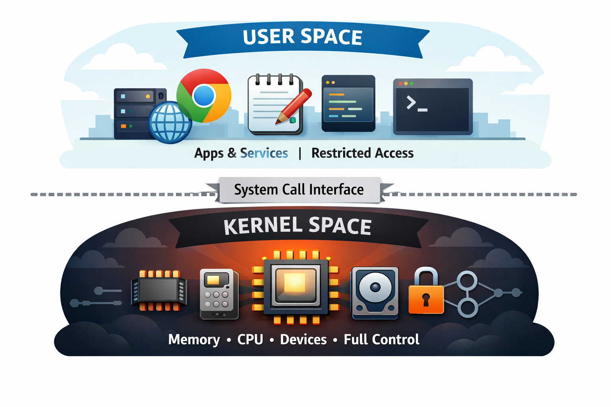
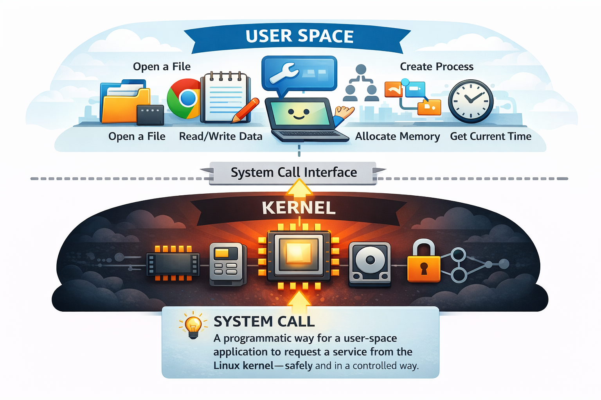
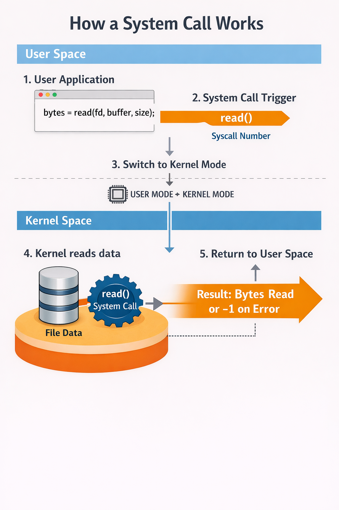

# Chapter 2: Linux System Calls

To understand how containers work, and how to secure them, it helps to know a few Linux fundamentals. One of these fundamentals is Linux system calls. Later chapters will build on this to explain how containers provide isolation, resource management, and security boundaries.

## What are Linux System Calls?

Linux splits execution into two main "worlds":
- **Userspace**:  Userspace is where *user-facing applications run*: web servers, Chrome, text editors, command-line tools, background services, etc. It's a restricted zone: applications cannot directly access hardware or manage critical system resources on their own. This restriction improves stability: if an application crashes, it usually doesn't crash the whole OS.
- **Kernel Space**: Kernel space is where the Linux kernel *runs the core of the operating system*. The kernel controls everything: memory, processes, scheduling, hardware and drivers, filesystems, networking, security, and more. It also interacts directly with the CPU, RAM, disk, and other hardware with full privileges.



**So where do system calls fit in?**

Applications run in userspace with lower privileges. If an application wants to do something that requires kernel privileges, like:
- opening a file
- reading/writing data
- creating a process
- allocating memory
- sending network traffic
- getting the current time

…it must ask the kernel to do it.

That request is made through the system call interface, also called the `syscall` interface.

> **Definition (in plain terms):** A system call is a programmatic way for a user-space application to request a service from the Linux kernel, safely and in a controlled way.



This distinction exists for security and stability:
- User programs can't directly touch hardware or kernel memory because that would be dangerous.
- System calls provide controlled entry points into the kernel.

Also, not everything needs the kernel. For example:
- Tokenizing a string happens entirely in userspace.
- But anything involving files, devices, networking, or process management requires `syscalls`.

Linux has 300+ system calls (the exact number varies by kernel version and CPU architecture). A few examples of common system calls:

| What the program wants | System call       |
| ---------------------- | ----------------- |
| Read a file            | `read()`          |
| Write a file           | `write()`         |
| Open a file            | `open()`          |
| Start a new program    | `execve()`        |
| Create a process       | `fork()`          |
| Allocate memory        | `mmap()`          |
| Send network data      | `send()`          |
| Get current time       | `clock_gettime()` |

You can browse the full list via the man page: [syscalls(2)](https://man7.org/linux/man-pages/man2/syscalls.2.html)

## How do System Calls Work?

At a high level, a syscall looks like a normal function call from the programmer's perspective but under the hood it performs a controlled transition into kernel mode.

Typical flow:
1. The user application calls a standard library function (for example `read()`).
2. That function triggers a system call using a system call number.
3. The CPU switches from user mode to kernel mode.
4. The Linux kernel executes the requested operation.
5. Control returns to the application with a result (or an error).

Example idea: calling `read(fd, buffer, size)` triggers the kernel's read implementation for that file descriptor and returns the number of bytes read (or `-1` on error, with details stored in `errno`).



## Small Example in C

As an application developer, you rarely need to invoke syscalls "raw." Usually you use higher-level abstractions:
- In C/C++: glibc provides wrapper functions (like `read()`, `write()`, `open()`, etc.)
- In Go: you may encounter the `syscall` package

These wrappers:
- validate and arrange arguments,
- perform the transition to kernel mode,
- return the result in a familiar way.

Here's a minimal C example that uses `write()` to print to standard output (file descriptor 1):

```c
#include <unistd.h>

int main() {
    const char msg[] = "Hello, World!\n";
    write(1, msg, sizeof(msg) - 1);
    return 0;
}
```

**What's happening step-by-step?**
1. `write(1, msg, sizeof(msg) - 1)` is called from userspace.
2. `write()` (from glibc) is a wrapper that prepares the syscall.
3. The process enters the kernel through the syscall interface.
4. The kernel validates:
    - that file descriptor 1 is valid,
    - that the process is allowed to write to it,
    - that the buffer points to accessible memory.
5. The kernel writes the bytes to stdout (often your terminal).
6. The kernel returns the number of bytes written, and execution continues in userspace.

Even though the code looks simple, the important takeaway is this:
**any time you interact with files, processes, networking, memory mapping, etc., you're going through system calls.**


## Containers and System Calls

A key point that many people miss early on: **Containers are just processes running on the host Linux kernel.**

That means containers don't have a separate kernel. They share the host kernel, and system calls are the only way container processes interact with that kernel.

So everything a container does, reading files, opening sockets, creating processes, flows through syscalls.

The application code uses syscalls the same way whether it runs on the host or inside a container. But containers introduce security implications, because:
- The container still depends on the host kernel.
- If a process can access powerful syscalls, it may be able to do powerful things.

This is where least privilege matters: **Not all applications need all system calls.** By restricting which syscalls a containerized application can use, you reduce the attack surface. 

## Conclusion

System calls are the "front door" into the kernel. Since containers are just Linux processes sharing the host kernel, every action a container takes ultimately becomes a syscall. That makes syscalls a powerful security control point: if an attacker compromises a containerized app, the damage they can do depends heavily on which syscalls and privileges that process is allowed to use.

This is why container hardening often focuses on reducing kernel exposure, using least privilege and Linux controls like `seccomp` (restricting syscalls), `capabilities` (dropping unnecessary privileges), and `namespaces`/`cgroups` (isolation and resource limits). In later chapters, we'll build directly on this idea to show how containers create boundaries, and how to tighten them.

Few more resources to learn about Linux system calls:
- [Tutorial - Write a System Call](https://brennan.io/2016/11/14/kernel-dev-ep3/)
- [The Definitive Guide to Linux System Calls](https://blog.packagecloud.io/the-definitive-guide-to-linux-system-calls/)

