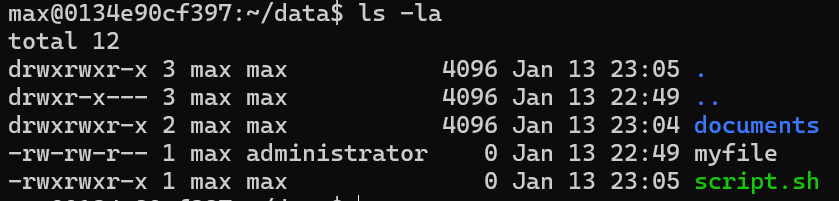

# Chapter 3: Linux File Permissions

Next, we will explore how Linux manages file permissions to ensure security and proper access control. File permissions are a fundamental aspect of Linux security, determining who can read, write, or execute files and directories, whether on a local system or within a containerized environment. In Linux everything is a file (program code, configuration, hardware devices, etc.), so understanding file permissions is crucial for managing system security effectively.


## Understanding Linux file permissions

Linux is built as a multi-user environment, where security of user data and system integrity is very important. Sometimes the efficient file security built into Linux can create problems for users and administrators who are not familiar with how it works.

File permissions have 3 basic components:
1. **User**: The owner of the file.
2. **Group**: A set of users who share access permissions. Groups are used for better administration control. Each user will belong to at least one default group.
3. **Others**: Everyone else who is not the owner or in the group.

When we create a file and check its permissions using the `ls -l` command, we see something like this:



If we break down the output column by column:
- The **first column** shows the file type and permissions. The first character indicates the file type (`-` for regular files, `d` for directories, etc.). The next nine characters are the file permissions. The permissions are divided into three sets of three characters. First set is for the owner, second set is for the group, and the third set is for others. There are 3 possible attributes that make up file access permissions.
    - `r` - Read permission. Whether the file may be read. In the case of a directory, this would mean the ability to list the contents of the directory.
    - `w` - Write permission. Whether the file may be written to or modified. For a directory, this defines whether you can make any changes to the contents of the directory. If write permission is not set then you will not be able to delete, rename or create a file.
    - `x` - Execute permission. Whether the file may be executed. In the case of a directory, this attribute decides whether you have permission to enter, run a search through that directory or execute some program from that directory.
- The **second column** indicates the number of hard links to the file.
- The **third column** shows the owner of the file.
- The **fourth column** shows the group associated with the file.


Let's look at our 3 basic examples from above:

1. `drwxrwxr-x 2 max max 4096 Jan 13 23:04 documents`: This is a directory (`d` at the start). The owner `max` has read, write, and execute permissions (`rwx`). The group `max` also has read, write, and execute permissions (`rwx`). Others have read and execute permissions (`r-x`), but not write permission.
2. `-rw-rw-r-- 1 max administrator 0 Jan 13 22:49 myfile`: This is a regular file (`-` at the start). The owner `max` has read and write permissions (`rw-`). The group `administrator` also has read and write permissions (`rw-`). Others have only read permission (`r--`).
3. `-rwxrwxr-x 1 max max 0 Jan 13 23:05 script.sh`: This is a regular file (`-` at the start). The owner `max` has read, write, and execute permissions (`rwx`). The group `max` also has read, write, and execute permissions (`rwx`). Others have read and execute permissions (`r-x`), but not write permission.

## Changing File Permissions

Now that we understand how to read file permissions, let's look at how to change them. The main command used to modify permissions in Linux is:

```bash
chmod
```

To change file permissions, you must be:
- the owner of the file, or
- the root (superuser).

Permissions can be changed in two main ways:
- **Symbolic mode (letters and operators)**: more readable
- **Numeric mode (octal numbers)**: faster and widely used in scripts

### Symbolic Mode (Using Letters)

Permissions can be defined for:
- `u`: user (owner)
- `g`: group
- `o`: others
- `a`: all (user + group + others)

Operators:
- `+`: add permission
- `-`: remove permission
- `=`: set exactly (overwrite existing permissions)

Permission bits:
- `r`: read
- `w`: write
- `x`: execute

Let's look at a basic symbolic mode example where we remove the execute permission from the user, add write permission to the group, and set read and write permission for others:

```bash
# BEFORE: -rwxr--r-- 1 max max 0 Jan 13 23:05 script.sh

chmod u-x,g+w,o+rw script.sh

# AFTER: -rw-rw-rw- 1 max max 0 Jan 13 23:05 script.sh
```

Here are a few more practical examples of using symbolic mode:
```bash
# 1) EXAMPLE: Removes write and execute from group.

# BEFORE: -rwxrwxrwx
chmod g-wx somefile
# AFTER: -rwxr--rwx

# 2) EXAMPLE: Give execute permission to everyone.
chmod a+x somefile # (Equivalent to chmod +x somefile)

# 3) EXAMPLE: Apply same change to group and others together.
chmod go-rx somefile

# 4) EXAMPLE: Set user and group permissions exactly to rwx, removing anything else.
chmod ug=rwx somefile

# 5) EXAMPLE: Copy permissions from another class. Others will receive the same permissions that group currently has.
chmod o=g somefile
```

> Using `chmod +x` is a common way to make a script executable. But this gives execute permission to everyone. If you want to give execute permission only to the owner, use `chmod u+x` instead.

### Numeric Mode (Using Octal Numbers)

Linux also allows permissions to be set using numbers. This is called octal mode and is very common in administration and scripting.

Each permission has a numeric value:
- `r` = 4
- `w` = 2
- `x` = 1

Add the values together to get the permission number. For example:

| Permissions | Value |
| ----------- | ----- |
| rwx         | 7     |
| rw-         | 6     |
| r-x         | 5     |
| r--         | 4     |
| -wx         | 3     |
| -w-         | 2     |
| --x         | 1     |
| ---         | 0     |

The syntax for using numeric mode is:
```bash
chmod XYZ filename
```

Where `X` is the permission for the user, `Y` is the permission for the group, and `Z` is the permission for others.

A few common examples of using numeric mode:
```bash
# 1) EXAMPLE: Owner can read/write, everyone else can read only.
chmod 644 somefile

# 2) EXAMPLE: Owner can read/write/execute; others can read and execute. This is very common for executable scripts and programs.
chmod 755 somefile

# 3) EXAMPLE: Private file: only owner can read/write, no permissions for group and others.
chmod 600 secret.txt
```

> ⚠️ Avoid setting permissions like 777 unless absolutely necessary. Giving everyone full access is convenient but unsafe. Even on a personal system, good permission habits prevent accidental damage and security issues.

## Changing File Ownership

In addition to permissions, Linux also allows you to change the ownership of files and directories. This is done using the `chown` command. Only root (or sudo) can change file ownership in most systems.

The syntax for `chown` is:
```bash
chown newuser somefile
```

You can also change the group ownership using the `chgrp` command:
```bash
chgrp newgroup somefile
```

## Understanding the setuid bit

In addition to the standard read (`r`), write (`w`), and execute (`x`) permissions, Linux supports three special permission bits that modify how files and directories behave:
- **setuid (Set User ID)**: The setuid bit applies to executable files.
- **setgid (Set Group ID)**: The setgid bit changes group behavior.
- **sticky bit**: The sticky bit applies mainly to directories. It controls who can delete files inside a writable directory.

These special bits are powerful and commonly used on multi-user systems. They enable controlled privilege elevation and safer collaboration,  but when misused, they can create serious security risks.

The focus of this section will be on the **setuid** bit, as it is the most relevant to understanding privilege escalation risks in Linux. When you run an executable file, the process that gets created inherits your user ID (the current user of the shell).

Some programs need temporary elevated privileges to perform specific tasks. This is where the setuid bit comes into play. **When the setuid bit is set on an executable file, it causes a program to run with the effective user ID  of the file’s owner**. This allows a regular user to run a specific program with elevated privileges, if the program owner is root.

> We advice to run this example in a disposable Ubuntu 24 Docker container. Run the container with: `docker run --rm -it ubuntu:24.04 bash -lc "set -e; apt update; apt install -y sudo nano build-essential; useradd -m -s /bin/bash test; usermod -aG sudo test; echo 'test ALL=(ALL) NOPASSWD:ALL' > /etc/sudoers.d/test; chmod 440 /etc/sudoers.d/test; exec su - test"`

Let's look at an common example of a SetUID program: the `passwd` command. The `passwd` command allows users to change their passwords, but updating the password file requires root privileges. To allow regular users to change their passwords, the `passwd` executable has the setuid bit set and is owned by root.

```bash
test@d4f8d29c759d:~$ ls -l `which passwd`
-rwsr-xr-x 1 root root 64152 May 30  2024 /usr/bin/passwd
test@d4f8d29c759d:~$
test@d4f8d29c759d:~$ cp /usr/bin/passwd ./mypasswd
test@d4f8d29c759d:~$
test@d4f8d29c759d:~$ ls -l mypasswd
-rwxr-xr-x 1 test test 64152 Feb  5 13:55 mypasswd
test@d4f8d29c759d:~$
```

When you copy the `passwd` command to your home directory, the setuid bit is not preserved, and the file is owned by your user (`test`). Therefore, when you run `./mypasswd`, it runs with your user privileges, not root and the command will not work as intended.

To demonstrate both “SetUID changes privileges” and why SetUID programs are risky we will create a simple SetUID demo program. That tiny program will:
- print real UID vs effective UID
- try a root-only action (write into /root/...)
- sleep so we can inspect the running process with ps

Follow these steps:
1. **Create a root-only target file**: This is the file our demo program will try to write into. Only root should have access to it.
    - Run: `sudo bash -lc 'echo "TOP SECRET" > /root/secret.txt && chmod 600 /root/secret.txt && ls -l /root/secret.txt'`
    - Expected output:
    ```
    -rw------- 1 root root 11 Feb  5 14:02 /root/secret.txt
    ```

2. **Create a SetUID demo program**: Open the file in the nano text editor: `nano suid_demo.c` and paste the following code:
    ```c
    #include <stdio.h>
    #include <unistd.h>
    #include <stdlib.h>
    #include <errno.h>
    #include <string.h>
    #include <fcntl.h>

    int main(int argc, char *argv[]) {
        int seconds = 30;
        if (argc >= 2) {
            seconds = atoi(argv[1]);
            if (seconds <= 0) seconds = 30;
        }

        uid_t ruid = getuid();
        uid_t euid = geteuid();

        printf("Real UID: %d\n", ruid);
        printf("Effective UID: %d\n", euid);

        // Attempt a root-only action: append to a file inside /root
        const char *path = "/root/secret.txt";
        int fd = open(path, O_WRONLY | O_APPEND);
        if (fd == -1) {
            printf("open(%s) failed: %s\n", path, strerror(errno));
        } else {
            const char *msg = "Appended by suid_demo\n";
            if (write(fd, msg, strlen(msg)) == -1) {
                printf("write() failed: %s\n", strerror(errno));
            } else {
                printf("SUCCESS: appended to %s\n", path);
            }
            close(fd);
        }

        printf("Sleeping %d seconds so you can inspect me with ps...\n", seconds);
        fflush(stdout);
        sleep(seconds);

        return 0;
    }
    ```
3. **Compile it**: `gcc suid_demo.c -o suid_demo`
4. **Run it normally**: `./suid_demo 60`
5. **You should see output similar to this**:
    ```
    test@d4f8d29c759d:~$ id
    uid=1001(test) gid=1001(test) groups=1001(test),27(sudo)

    test@d4f8d29c759d:~$ ./suid_demo 60
    Real UID: 1001
    Effective UID: 1001
    open(/root/secret.txt) failed: Permission denied
    Sleeping 60 seconds so you can inspect me with ps...
    ```
    - We can see that both Real UID and Effective UID are the same (1001, our user), and the attempt to open `/root/secret.txt` failed due to permission denied.
    - If running the `ps ajf` command from another terminal (while the program is running) we can see the following output:
    ```
    root@d4f8d29c759d:/# ps ajf
    PPID   PID  PGID   SID TTY      TPGID STAT   UID   TIME COMMAND
        0  1774  1774  1774 pts/1     1783 Ss       0   0:00 bash
    1774  1783  1783  1774 pts/1     1783 R+       0   0:00  \_ ps ajf
        0     1     1     1 pts/0     1782 Ss       0   0:00 su - test
        1  1746  1746     1 pts/0     1782 S     1001   0:00 -bash
    1746  1782  1782     1 pts/0     1782 S+    1001   0:00  \_ ./suid_demo 60
    ```
    - The last line shows our `suid_demo` process running with UID 1001.
6. **Turn it into a SetUID-root binary**
    - Run these commands:
    ```bash
    sudo chown root:root suid_demo
    sudo chmod 4755 suid_demo # set the setuid bit
    ls -l suid_demo
    ```
    - We should now see that the owner is root and the permissions show an `s` in place of the user execute bit:
    ```
    test@d4f8d29c759d:~$ ls -l suid_demo
    -rwsr-xr-x 1 root root 16488 Feb  5 14:06 suid_demo
    ```
7. **Run it again as a normal user: `./suid_demo 60`**
    - The script runs again, but this time successfully appends to `/root/secret.txt`. We can see the effective UID is now 0 (root), but the real UID is still our user (1001).:
    ```
    test@d4f8d29c759d:~$ ./suid_demo 60
    Real UID: 1001
    Effective UID: 0
    SUCCESS: appended to /root/secret.txt
    Sleeping 60 seconds so you can inspect me with ps...
    test@d4f8d29c759d:~$
    ```
    - Running `ps ajf` from another terminal confirms the effective UID is 0:
    ``` 
    root@d4f8d29c759d:/# ps ajf
    PPID   PID  PGID   SID TTY      TPGID STAT   UID   TIME COMMAND
        0  1774  1774  1774 pts/1     1793 Ss       0   0:00 bash
    1774  1793  1793  1774 pts/1     1793 R+       0   0:00  \_ ps ajf
        0     1     1     1 pts/0     1792 Ss       0   0:00 su - test
        1  1746  1746     1 pts/0     1792 S     1001   0:00 -bash
    1746  1792  1792     1 pts/0     1792 S+       0   0:00  \_ ./suid_demo 60
    ```
    - This exmaple confirms that the setuid bit allowed our program to run with the privileges of the file owner (root), even though we executed it as a normal user.
    - Look inside the `sudo cat /root/secret.txt` file to verify the append worked:
    ```bash
    test@d4f8d29c759d:~$ sudo cat /root/secret.txt
    TOP SECRET
    Appended by suid_demo
    ```

This simple demo shows why SetUID-root binaries are treated as high-risk and must be written extremely carefully. A SetUID program runs with the effective user ID of the file owner, rather than the calling user. When the file owner is root, this results in privilege elevation, which is why SetUID-root programs are security sensitive. If such a program contains a bug, for example unsafe input handling, path confusion, or command execution issues, it can become a privilege-escalation vector if the file is owned by root.

The setuid bit comes from a time when Linux privilege management was simpler and more coarse-grained. The basic model was:
- root → full privileges
- non-root → very limited privileges

SetUID was introduced as a mechanism to let non-root users perform specific privileged operations through carefully controlled programs. Starting with Linux kernel 2.2, more advanced security mechanisms were introduced, most notably Linux capabilities. 

Capabilities break the all-powerful root privilege into many smaller, specific privileges that can be granted independently. This follows the principle of least privilege: give a program only the exact permissions it needs, nothing more.

> Historically, the `ping` command required the setuid bit because it needed to open raw network sockets, which is a privileged operation.

SetUID is still used for some core system tools, but it should be considered a legacy elevation mechanism and applied only when absolutely necessary.
